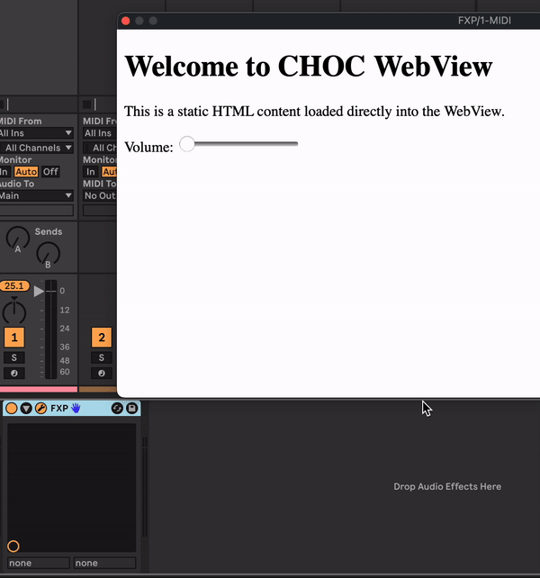

# Build VST or Audio Unit plug-in using Javascript (Basic)

If you are a web developer who has ever wanted to create an audio plug-in for Logic, Reason, Ableton, Cubase, etc, this is the easiest path to success.

## webui added 🚀😄🚀😄🚀😄🚀😄🚀😄🚀😄🚀😄🚀😄🚀😄🚀

## Getting Started

[Setup Guide](https://www.chrisjmendez.com/2023/03/29/build-vst-or-audio-unit-plugin-using-javascript-basic/)


## Resources 

* [Elementary.Audio](https://www.elementary.audio/)


## Build Instructions

To build the project, run the following command:

```markdown
cd ./build
cmake --build .
cd ../js; and npm run build; and cd -; and cmake --build .
